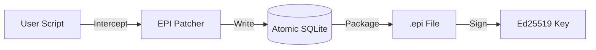

<p align="center">
  
  <br>
  <h1 align="center">EPI Recorder</h1>
</p>

[](https://github.com/mohdibrahimaiml/epi-recorder/releases)
[](https://pypi.org/project/epi-recorder/)
[](LICENSE)
[](https://pypi.org/project/epi-recorder/)

**The Flight Recorder for AI Agents**
*Like a PDF for AI Evidence*

Debug production failures in LangChain, CrewAI, and custom agents with one command.
Captures complete execution context—prompts, responses, tool calls—and cryptographically seals them for verification.

[📖 Documentation](https://epilabs.org) • [🚀 Quick Start](#quick-start) • [🔐 Security](#security)

---

## Why EPI?

Your AI agent failed in production. It hallucinated. It looped infinitely. It cost you $50 in API calls.

**You can't reproduce it.** LLMs are non-deterministic. Your logs don't show the full prompt context. You're taking screenshots and pasting JSON into Slack.

**EPI is the black box.** One command captures everything. Debug locally. Prove what happened.

---

## Quick Start

```bash
pip install epi-recorder

# Record your agent (zero config)
epi run agent.py

# View the recording (opens browser)
epi view recording.epi

# Verify integrity (cryptographic proof)
epi verify recording.epi
```

---

## Features

- **⚡ Zero Config**: `epi run` intercepts OpenAI, Gemini, LangChain, CrewAI automatically—no code changes.
- **🔍 Debug Tools**: `epi debug` analyzes recordings for loops, hallucinations, and inefficiencies.
- **🛡️ Crash Safe**: Atomic SQLite storage survives OOM and power failures.
- **🔐 Tamper Proof**: Ed25519 signatures prove logs weren't edited.
- **🌐 Framework Agnostic**: Works with any Python agent.

---

## How It Works

EPI injects instrumentation at the Python runtime level via `sitecustomize.py`.

1.  **Intercept**: Captures LLM calls at the HTTP layer and library level.
2.  **Store**: Atomic SQLite WAL ensures data safety on crashes.
3.  **Analyze**: `epi debug` uses heuristics to find root causes.
4.  **Seal**: Ed25519 signatures create verifiable evidence.



---

## Security

EPI provides cryptographic infrastructure for verifiable AI logging:

-   **Signatures**: Ed25519 with client-side verification.
-   **Privacy**: Automatic API key and secret redaction.
-   **Offline**: Air-gapped operation, no cloud required.

---

## Release History

| Version | Date | Highlights |
|:---|:---|:---|
| **v2.2.0** | 2026-01-30 | Agent Debugging, SQLite Storage, Thread-Safe, MIT License |
| **v2.1.3** | 2026-01-24 | Gemini Support, `epi chat` command |
| **v2.1.2** | 2026-01-17 | Client-Side Verification |
| **v2.1.1** | 2025-12-16 | Installation Fixes, `epi doctor` |
| **v2.1.0** | 2025-12-15 | Initial Release, `epi run` zero-config |

---

## Contributing

We welcome contributions! Please see [CONTRIBUTING.md](./CONTRIBUTING.md) for details.

```bash
git clone https://github.com/mohdibrahimaiml/epi-recorder.git
cd epi-recorder
pip install -e ".[dev]"
pytest
```

---

## License

MIT License. See [LICENSE](./LICENSE) for details.
