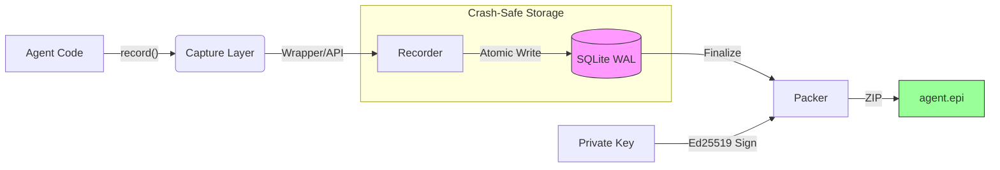

<p align="center">
  
  <br>
  <h1 align="center">EPI</h1>
  <p align="center"><strong>Execution evidence system for AI agents</strong></p>
  <p align="center">
    <em>Capture, seal, and verify every decision your agents make</em>
  </p>
</p>

<p align="center">
  <a href="https://pypi.org/project/epi-recorder/"></a>
  <a href="https://pepy.tech/project/epi-recorder"></a>
  <a href="https://github.com/mohdibrahimaiml/epi-recorder"></a>
  <a href="LICENSE"></a>
  <a href="https://github.com/mohdibrahimaiml/epi-recorder/stargazers"></a>
</p>

---

## What is EPI?

EPI is a **file format and recorder** that turns agent execution into durable, verifiable artifacts.

An `.epi` file is a **flight recorder for AI systems** — it captures every decision, tool call, and state transition, sealed with cryptographic signatures. No cloud dependency. No vendor lock-in. Works offline forever.

**Core guarantees:**
- **Capture once, inspect forever** — self-contained artifacts with embedded viewer
- **Complete execution history** — prompts, responses, state, timestamps, costs
- **Tamper-evident proof** — Ed25519 signatures for compliance and audits
- **Replay production failures** — debug locally with full context

---

## Architecture



**Design principles:**

1. **Crash-safe** — SQLite WAL ensures no data loss, even if agents crash mid-execution
2. **Explicit capture** — evidence is intentional and reviewable in code
3. **Cryptographic proof** — Ed25519 signatures that can't be forged or backdated
4. **Offline-first** — no cloud dependency; works in air-gapped environments

---

## Quick Start

### 1. Install

```bash
pip install epi-recorder
```

### 2. Record an Agent Run

```python
from epi_recorder import record, wrap_openai
from openai import OpenAI

client = wrap_openai(OpenAI())

with record("my_agent.epi"):
    response = client.chat.completions.create(
        model="gpt-4",
        messages=[{"role": "user", "content": "Plan a trip to Tokyo"}]
    )
```

That's it. EPI captures the full prompt and response, token usage and cost, timestamps and model info, and a complete environment snapshot.

### 3. Inspect the Results

```bash
epi view my_agent.epi    # Opens in browser — no login, no cloud
epi verify my_agent.epi  # Verify cryptographic integrity
```

### 4. Analyze Performance Across Runs

```python
from epi_recorder import AgentAnalytics

analytics = AgentAnalytics("./production_runs")
summary = analytics.performance_summary()

print(f"Success rate: {summary['success_rate']:.1%}")
print(f"Avg cost: ${summary['avg_cost_per_run']:.3f}")
print(f"Most common error: {summary['top_errors'][0]}")

analytics.generate_report("dashboard.html")
```

**[Full Documentation →](docs/)** · **[Example .epi File →](examples/demo_agent.epi)**

---

## The Problem EPI Solves

Production agents fail in ways traditional logging can't capture.

**Scenario:** A LangGraph agent processes 47 steps overnight. Step 31 makes a bad decision that cascades into failure. CloudWatch logs expired. You have no idea what the agent was "thinking."

| Traditional Logs | EPI Artifacts |
|:-----------------|:--------------|
| Expire after retention period | Persist forever as files |
| Missing agent state and reasoning | Complete checkpoint history |
| Can't replay locally | Full local replay with Ollama |
| No cryptographic proof | Ed25519 signatures for audits |

**Real incident:** An AutoGen agent approved a $12,000 refund instead of $120. With EPI, the team opened the `.epi` file, found the OCR preprocessing bug at step 17, and fixed it in 15 minutes. The signed artifact served as compliance evidence.

---

## Supported Providers

| Provider | Integration |
|:---------|:------------|
| OpenAI | `wrap_openai()` wrapper or explicit API |
| Anthropic | `wrap_anthropic()` wrapper or explicit API |
| Google Gemini | Explicit API |
| Ollama (local) | `wrap_openai()` with local endpoint |
| Any HTTP LLM | `log_llm_call()` explicit API |

EPI is provider-agnostic. The explicit API works with any response format.

---

## Key Features

### Async Support

Non-blocking I/O for LangGraph, AutoGen, and async-first frameworks:

```python
async with record("agent.epi"):
    response = await async_client.chat.completions.create(...)
    await epi.alog_step("custom.event", {"reasoning": "..."})
```

### Local LLM Support

Record against Ollama for free, unlimited development:

```python
client = wrap_openai(OpenAI(
    base_url="http://localhost:11434/v1",
    api_key="ollama"
))

with record("test.epi"):
    response = client.chat.completions.create(
        model="deepseek-r1:7b",
        messages=[{"role": "user", "content": "Debug this code..."}]
    )
```

### LangGraph Checkpoint Integration

Native checkpoint saver for LangGraph state management:

```python
from langgraph.graph import StateGraph
from epi_recorder.integrations import EPICheckpointSaver

graph = StateGraph(AgentState)
checkpointer = EPICheckpointSaver("my_agent.epi")

result = graph.invoke(
    {"messages": [HumanMessage(content="...")]},
    {"configurable": {"thread_id": "user_123"}},
    checkpointer=checkpointer
)
```

Captures all state transitions, checkpoint metadata, agent decision points, and handles large states (>1MB) via hashing.

### Agent Analytics

Track performance across hundreds of runs:

```python
analytics = AgentAnalytics("./production_runs")
summary = analytics.performance_summary()
analytics.generate_report("performance.html")
```

Provides success rate trends, cost analysis, error pattern detection, tool usage distribution, and period-to-period comparisons.

---

## Why EPI vs. Alternatives

EPI is not an observability dashboard. It's a **durable execution artifact system.**

Dashboards give you live metrics. EPI gives you portable, offline-verifiable records that last forever.

| Feature | **EPI** | LangSmith | Arize | W&B |
|:--------|:--------|:----------|:------|:----|
| **Offline-first** | Works without internet | Cloud required | Cloud required | Cloud required |
| **Agent state capture** | Full checkpoints (LangGraph native) | Traces only | Predictions only | Experiments only |
| **Cryptographic proof** | Ed25519 signatures | None | None | None |
| **Format lock-in** | Open spec (`.epi` format) | Proprietary API | Proprietary | Proprietary |
| **Compliance-ready** | EU AI Act, FDA, litigation | Limited | Limited | Not designed |
| **Local LLM support** | Ollama, llama.cpp | Cloud only | Cloud only | Cloud only |
| **Cost** | Free (open source) | $99+/mo | Custom pricing | $50+/mo |
| **Data privacy** | Self-hosted, offline | Cloud-dependent | Cloud-dependent | Cloud-dependent |

**EPI complements these tools** — use both for complete agent observability.

---

## The `.epi` Artifact Format

An `.epi` file is a self-contained ZIP archive with a defined structure:

```
my_agent.epi
├── mimetype              # "application/epi+zip"
├── manifest.json         # Metadata + Ed25519 signature
├── steps.jsonl           # Execution timeline (NDJSON)
├── env.json              # Runtime environment snapshot
└── viewer/
    └── index.html        # Self-contained offline viewer
```

**Properties:** self-contained (no external dependencies), universally viewable (opens in any browser), tamper-evident (Ed25519 signatures), and durable (works offline forever).

See **[EPI Specification](docs/EPI-SPEC.md)** for technical details.

---

## Cryptographic Properties

| Property | Implementation |
|:---------|:---------------|
| **Signatures** | Ed25519 (RFC 8032) |
| **Hashing** | SHA-256 content addressing |
| **Key Storage** | Local keyring, user-controlled |
| **Verification** | Client-side, zero external dependencies |

Signatures are optional but recommended. Unsigned artifacts are valid but can't prove origin.

---

## Use Cases

### Developer Workflow

- Debug multi-step agent failures with full decision tree visibility
- A/B test prompts and models with side-by-side run comparison
- Track agent performance over time (success rates, costs, errors)
- Replay production failures locally with Ollama or real LLMs
- Share `.epi` files with teammates for collaborative debugging

### Enterprise Compliance

- Audit trails for regulators (EU AI Act, FDA, SEC)
- Litigation-grade evidence with cryptographic signatures
- Data governance with PII redaction and retention policies
- On-premises deployment for air-gapped environments

### Works With

LangGraph · LangChain · AutoGen · CrewAI · Custom frameworks · Any Python agent

---

## CLI Reference

| Command | Purpose |
|:--------|:--------|
| `epi run <script.py>` | Record execution to `.epi` |
| `epi verify <file.epi>` | Verify integrity and signature |
| `epi view <file.epi>` | Open in browser viewer |
| `epi keys list` | Manage signing keys |
| `epi debug <file.epi>` | Heuristic analysis |
| `epi chat <file.epi>` | Natural language querying |

See **[CLI Reference](docs/CLI.md)** for full documentation.

---

## Roadmap

**Current (v2.5.0):**
- Capture, verify, and replay agent runs
- LangGraph checkpoint integration
- Agent analytics across runs
- OpenAI and Anthropic wrapper clients

**Next:**
- Time-travel debugging (step through any past run)
- Team collaboration features
- Managed cloud platform (optional)

---

## Release History

| Version | Date | Highlights |
|:--------|:-----|:-----------|
| **2.5.0** | 2026-02-13 | Anthropic Claude wrapper, path resolution fix |
| **2.4.0** | 2026-02-12 | Agent Analytics, async/await, LangGraph, Ollama |
| **2.3.0** | 2026-02-06 | Explicit API, wrapper clients |
| **2.2.0** | 2026-01-30 | SQLite WAL, async support, thread safety |
| **2.1.3** | 2026-01-24 | Google Gemini support |

See **[CHANGELOG.md](./CHANGELOG.md)** for detailed release notes.

---

## Documentation

| Document | Description |
|:---------|:------------|
| **[EPI Specification](docs/EPI-SPEC.md)** | Technical specification for `.epi` format |
| **[CLI Reference](docs/CLI.md)** | Command-line interface documentation |
| **[CHANGELOG](CHANGELOG.md)** | Release notes |
| **[Contributing](CONTRIBUTING.md)** | Contribution guidelines |
| **[Security](SECURITY.md)** | Security policy and vulnerability reporting |

---

## Beta Program

We're looking for teams running agents in production.

**You get:** priority support, free forever, custom integrations.

**[Apply for Beta Access →](https://www.epilabs.org/contact.html)**

---

## Contributing

```bash
git clone https://github.com/mohdibrahimaiml/epi-recorder.git
cd epi-recorder
pip install -e ".[dev]"
pytest
```

See **[CONTRIBUTING.md](./CONTRIBUTING.md)** for guidelines.

---

## Traction

**6,500+ downloads** in 10 weeks · **v2.5.0** shipped Feb 2026

> *"EPI saved us 4 hours debugging a production agent failure."*
> — ML Engineer, Fintech

> *"The LangGraph integration is killer. Zero config."*
> — AI Platform Team Lead

---

## License

MIT License. See **[LICENSE](./LICENSE)**.

<p align="center">
  <strong>Built by <a href="https://epilabs.org">EPI Labs</a></strong><br>
  <em>Making AI agent execution verifiable.</em>
</p>
