```mermaid
graph LR
    User[👤 You] -->|Runs Script| Recorder[📹 EPI Recorder]
    Recorder -->|Intercepts| APIs[☁️ External APIs]
    Recorder -->|Captures| Sys[💻 System / Files]
    
    Recorder -->|Packages| EPI[📦 .EPI File]
    
    subgraph "Inside the Package"
        EPI --> Man[Manifest & Signatures]
        EPI --> Logs[Event Timeline]
        EPI --> Data[Artifacts]
        EPI --> View[HTML Viewer]
    end
    
    EPI -->|Verify| Verifier[🛡️ Validator]
    EPI -->|Open| Browser[🌐 Offline Browser]
```

<div align="center">

# 📦 EPI
### Evidence Packaged Infrastructure

> **The "PDF" for AI Evidence**

[](LICENSE)
[](https://www.python.org/downloads/)
[](https://pypi.org/project/epi-recorder/)
[](https://colab.research.google.com/github/mohdibrahimaiml/EPI-V2.1.0/blob/main/colab_demo.ipynb)

<br/>

**Think of it like this:**  
*If a **PDF** preserves a document so it looks the same everywhere...*  
*...an **EPI** file preserves an AI workflow so it **runs the same everywhere**.*

[🎥 View Demo Video](https://colab.research.google.com/github/mohdibrahimaiml/EPI-V2.1.0/blob/main/colab_demo.ipynb) • [📚 Read the Docs](docs/CLI.md) • [🐛 Report Bug](https://github.com/mohdibrahimaiml/EPI-V2.1.0/issues)

</div>

---

## ⚡ Why EPI?

AI is moving from "Chatbots" to "Agents" that handle money, contracts, and sensitive data. But right now, AI runs are opaque.
**EPI fixes this.** It turns every execution into a **cryptographically signed receipt**.

| Feature | 📄 PDF (Document Standard) | 📦 EPI (Execution Standard) |
| :--- | :--- | :--- |
| **Goal** | Visual Consistency | Computational Integrity |
| **Captures** | Fonts, Layout, Images | Code, API Calls, Environment |
| **Verification** | 👁️ Visual Check | 🔐 **Ed25519 Signature** |
| **Safety** | ⚠️ Runs Scripts (Unsafe) | ✅ **Static HTML (Safe)** |
| **Analogy** | A digital photo | A digital black-box |

---

## 🚀 Quick Start in 30 Seconds

### 1️⃣ Install
```bash
pip install epi-recorder
```

### 2️⃣ Record
Wrap any script. EPI intercepts shell commands, file I/O, and LLM calls (OpenAI, etc.).
```bash
epi record --out result.epi -- python agent.py
```
*> Creates `result.epi` (a ZIP containing the code, logs, and evidence)*

### 3️⃣ View
Open the evidence in your browser. zero-install, works offline.
```bash
epi view result.epi
```

---

## ⚙️ How It Works

EPI unifies three powerful components into one standard format:

#### 📹 1. The Recorder (`epi record`)
A system-level trace that captures:
*   **Shell**: Stdout, stderr, exit codes.
*   **API Calls**: Caches and redacted logs of LLM requests (OpenAI, Anthropic, Ollama).
*   **Files**: Tracks every file read or written by the script.
*   **Environment**: OS version, Python packages, git commit hash.

#### 📦 2. The Container (`.epi`)
A portable, ZIP-based "Truth File".
```text
evidence.epi
├── manifest.json        # 📝 Metadata + Ed25519 Signature
├── steps.jsonl          # ⏱️ Micro-timeline of every event
├── artifacts/           # 💾 Content-addressed files (SHA-256)
├── cache/               # 🔄 Replay cache for deterministic runs
└── viewer/              # 🖥️ Embedded HTML5 Viewer (Offline)
```

#### 🛡️ 3. The Verifier (`epi verify`)
Ensures the evidence is mostly authentic.
*   ✅ **Integrity**: Verifies SHA-256 hashes of the timeline.
*   ✅ **Authenticity**: Validates the **Ed25519** signature against the author's key.
*   ✅ **Reproducibility**: Re-runs checks to confirm outputs match inputs.

---

## 🧩 Architecture



---

## 🔐 Security & Privacy

*   **Safe by Design**: The viewer is **100% static HTML/JSON**. It never executes the recorded code, making it safe to open files from untrusted sources.
*   **Privacy First**: API keys (e.g., `sk-proj-...`) are automatically detected and **redacted** from logs before they are saved.
*   **No Lock-In**: The format is open (ZIP + JSON). You can unzip it and audit the raw data anytime.

---

## 📚 Documentation
*   **[CLI Reference](docs/CLI.md)**: Master the `init`, `run`, `doctor`, and `keys` commands.
*   **[File Specification](docs/EPI-SPEC.md)**: Deep dive into the format mechanics.

---

## 📄 License
**Apache 2.0** — Open for commercial and private use.

<div align="center">
  <br/>
  <b>Built for the future of AI Transparency.</b><br>
  <i>Turning opaque runs into verifiable proofs.</i>
</div>

> **The "PDF" for AI Evidence**

[](LICENSE)
[](https://www.python.org/downloads/)
[](https://pypi.org/project/epi-recorder/)
[](https://colab.research.google.com/github/mohdibrahimaiml/EPI-V2.1.0/blob/main/colab_demo.ipynb)

---

## 💡 The Concept
**EPI files are self-contained evidence packages.**

<p align="center">
  
</p>

Just as a **PDF** captures a document's layout, fonts, and images so it looks the same everywhere, an **EPI** file captures an AI workflow's code, inputs, model calls, and environment so it **runs the same everywhere**.

| Feature | 📄 PDF (Document Standard) | 📦 EPI (Execution Standard) |
| :--- | :--- | :--- |
| **Purpose** | Visual fidelity | Computational fidelity |
| **Captures** | Text, Layout, Images | Code, API Calls, Environment |
| **Verification** | None (Visual only) | **Cryptographic (Ed25519)** |
| **Safety** | Reader executes JS (Unsafe) | **Static HTML Viewer (Safe)** |
| **Analogy** | A photograph of a document | A black-box recording of a process |

---

## 🚀 Quick Start (30 Seconds)

### 1. Install
```bash
pip install epi-recorder
```

### 2. Record
Run your script with `epi record`. It captures everything automatically.
```bash
epi record --out my_run.epi -- python train_model.py
```

### 3. View
Open the evidence package in your browser. No internet required.
```bash
epi view my_run.epi
```

> **Try it now:** [Open the Live Demo in Google Colab](https://colab.research.google.com/github/mohdibrahimaiml/EPI-V2.1.0/blob/main/colab_demo.ipynb)

---

## 📚 Full Documentation

- **[CLI Reference (v2.1.0)](docs/CLI.md)**: fast `init`, `doctor`, `keys`, and more.
- **[EPI File Specification](docs/EPI-SPEC.md)**: Technical details on the format and cryptography.

---

## ⚙️ How It Works

EPI transforms opaque AI runs into transparent, verifiable proofs by unifying three components:

### 1. The Recorder (`epi record`)
Intercepts execution at the system level.
- **Shell**: Commands, stdout/stderr, exit codes.
- **LLM APIs**: OpenAI, Ollama, Anthropic (inputs/outputs logged & cached).
- **Files**: Inputs read and artifacts written.
- **Environment**: OS, Python packages, git state.

### 2. The Container (`.epi`)
A ZIP-based format that holds the truth.
```text
my_run.epi
├── manifest.json        # Metadata + Ed25519 Signature
├── steps.jsonl          # Chronological timeline of events
├── artifacts/           # Content-addressed files (sha256)
├── cache/               # Cached LLM responses (for deterministic replay)
└── viewer/              # Embedded HTML/JS viewer (Zero-install)
```

### 3. The Verifier (`epi verify`)
Ensures the package hasn't been tampered with.
- Checks **SHA-256** hashes of every step.
- Validates **Ed25519** cryptographic signature.
- Re-executes checks (e.g., "Accuracy > 90%").

---

## 🧩 Architecture


---

## 🔐 Security & Privacy

### "Safe by Default"
- **Read-Only**: The Viewer is just static HTML/JSON. It **never executes code** from the file.
- **Redaction**: API keys (OpenAI, AWS, etc.) are automatically detected and redacted before saving.
- **Sandboxed**: Replaying a workflow (`epi replay`) runs in a constrained environment.

---

## 🐍 Python API

For deeper integration, use the Python context manager.

```python
from epi_recorder import record

# Everything inside this block is recorded
with record("experiment.epi", goal="Test Llama-3 Performance"):
    
    # 1. This LLM call is intercepted & cached
    response = openai.chat.completions.create(
        model="gpt-4",
        messages=[{"role": "user", "content": "Hello"}]
    )
    
    # 2. Files created here are saved as artifacts
    with open("result.txt", "w") as f:
        f.write(response.choices[0].message.content)

# result.epi is now saved and signed!
```

---

## 📄 License
**Apache 2.0** - Open Source and compatible with commercial use.

---

<p align="center">
  <b>Built for the future of AI Transparency.</b><br>
  <i>Turning opaque runs into verifiable proofs.</i>
</p>

> **The "PDF" for AI Evidence**

[](LICENSE)
[](https://www.python.org/downloads/)
[](https://pypi.org/project/epi-recorder/)
[](https://colab.research.google.com/github/mohdibrahimaiml/EPI-V2.0.0/blob/main/colab_demo.ipynb)

---

## 💡 The Concept
**EPI files are self-contained evidence packages.**

<p align="center">
  
</p>

Just as a **PDF** captures a document's layout, fonts, and images so it looks the same everywhere, an **EPI** file captures an AI workflow's code, inputs, model calls, and environment so it **runs the same everywhere**.

| Feature | 📄 PDF (Document Standard) | 📦 EPI (Execution Standard) |
| :--- | :--- | :--- |
| **Purpose** | Visual fidelity | Computational fidelity |
| **Captures** | Text, Layout, Images | Code, API Calls, Environment |
| **Verification** | None (Visual only) | **Cryptographic (Ed25519)** |
| **Safety** | Reader executes JS (Unsafe) | **Static HTML Viewer (Safe)** |
| **Analogy** | A photograph of a document | A black-box recording of a process |

---

## 🚀 Quick Start (30 Seconds)

### 1. Install
```bash
pip install epi-recorder
```

### 2. Record
Run your script with `epi record`. It captures everything automatically.
```bash
epi record --out my_run.epi -- python train_model.py
```

### 3. View
Open the evidence package in your browser. No internet required.
```bash
epi view my_run.epi
```

> **Try it now:** [Open the Live Demo in Google Colab](https://colab.research.google.com/github/mohdibrahimaiml/EPI-V1.1/blob/main/colab_demo.ipynb)

---

## ⚙️ How It Works

EPI transforms opaque AI runs into transparent, verifiable proofs by unifying three components:

### 1. The Recorder (`epi record`)
Intercepts execution at the system level.
- **Shell**: Commands, stdout/stderr, exit codes.
- **LLM APIs**: OpenAI, Ollama, Anthropic (inputs/outputs logged & cached).
- **Files**: Inputs read and artifacts written.
- **Environment**: OS, Python packages, git state.

### 2. The Container (`.epi`)
A ZIP-based format that holds the truth.
```text
my_run.epi
├── manifest.json        # Metadata + Ed25519 Signature
├── steps.jsonl          # Chronological timeline of events
├── artifacts/           # Content-addressed files (sha256)
├── cache/               # Cached LLM responses (for deterministic replay)
└── viewer/              # Embedded HTML/JS viewer (Zero-install)
```

### 3. The Verifier (`epi verify`)
Ensures the package hasn't been tampered with.
- Checks **SHA-256** hashes of every step.
- Validates **Ed25519** cryptographic signature.
- Re-executes checks (e.g., "Accuracy > 90%").

---

## 🧩 Architecture


---

## 🔐 Security & Privacy

### "Safe by Default"
- **Read-Only**: The Viewer is just static HTML/JSON. It **never executes code** from the file.
- **Redaction**: API keys (OpenAI, AWS, etc.) are automatically detected and redacted before saving.
- **Sandboxed**: Replaying a workflow (`epi replay`) runs in a constrained environment.

---

## 🐍 Python API

For deeper integration, use the Python context manager.

```python
from epi_recorder import record

# Everything inside this block is recorded
with record("experiment.epi", goal="Test Llama-3 Performance"):
    
    # 1. This LLM call is intercepted & cached
    response = openai.chat.completions.create(
        model="gpt-4",
        messages=[{"role": "user", "content": "Hello"}]
    )
    
    # 2. Files created here are saved as artifacts
    with open("result.txt", "w") as f:
        f.write(response.choices[0].message.content)

# result.epi is now saved and signed!
```

---

## 📄 License
**Apache 2.0** - Open Source and compatible with commercial use.

---

<p align="center">
  <b>Built for the future of AI Transparency.</b><br>
  <i>Turning opaque runs into verifiable proofs.</i>
</p>
